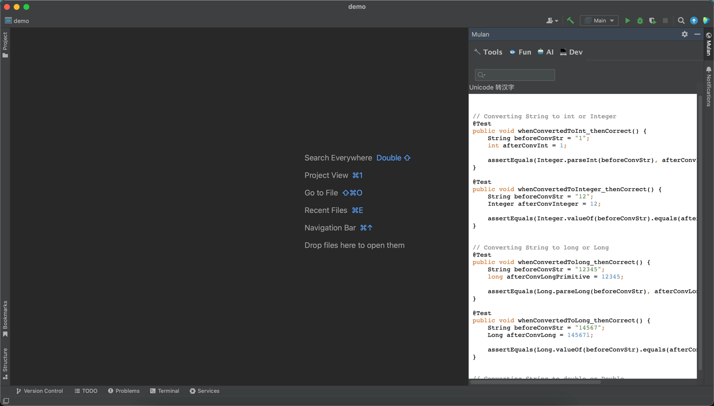
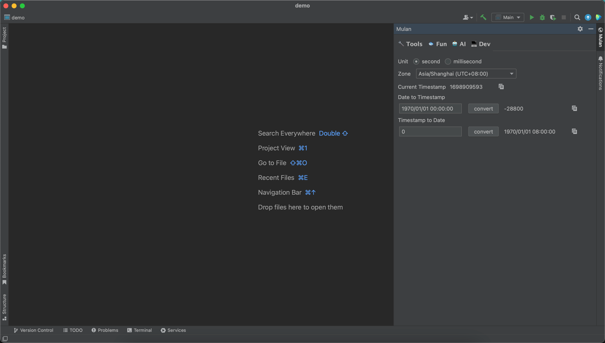
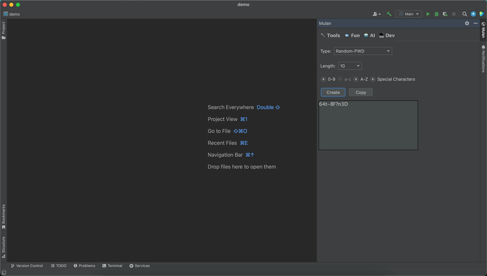
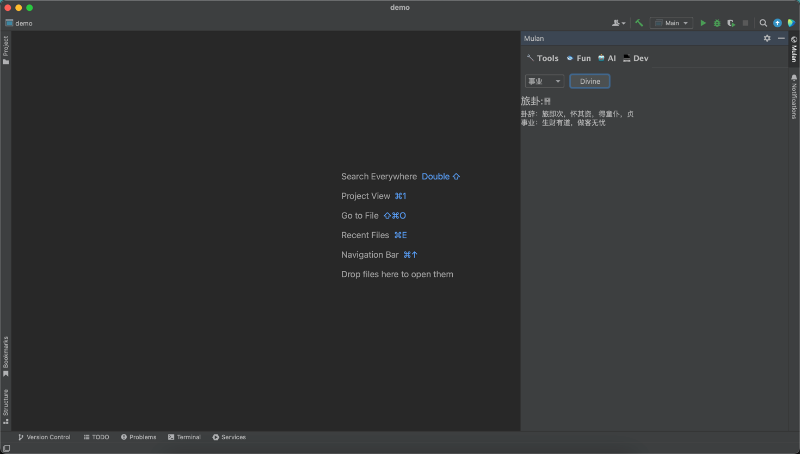

# idea-tools
IDEA 工具插件

# 功能列表

## 开发相关
1. AI 解释/优化代码
2. *AI 解决异常问题 (endpoint)
3. *示例代码(常用的代码块)

## 开发工具
1. *时间戳转换
2. YAML/JSON/XML/HTML 格式化
3. MyBatis 日志还原成可执行SQL
4. *加密/解密 (UrlEncode, Base64, MD5, SHA1, SHA256, SHA512)
5. *正则测试
6. *Crontab执行时间计算
7. 批量UUID

## 效率工具
1. *随机密码
2. 计算器
3. 剪切板
4. *截图 OCR
5. 日期时间计算

## 魔芋工具
1. *今天吃点啥
2. *算卦 (https://www.buyiju.com/suangua/)
3. 看书
4. 养生指南(文档)
5. *保健时钟(定时提醒)

